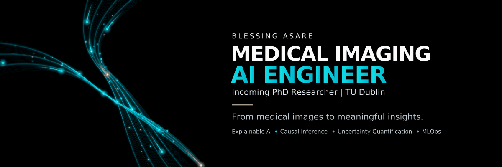

  

  <strong>Incoming PhD Researcher · TU Dublin</strong> 
  <em>Research Ireland Scholar · MSc Digital Health</em>

  
  
  

  <a href="#about-me">About</a> ·
  <a href="#technical-stack">Stack</a> ·
  <a href="#publications-and-research-output">Publications</a> ·
  <a href="#featured-projects">Projects</a> ·
  <a href="#doctoral-research">PhD Research</a> ·
  <a href="#notable-repositories">Repositories</a> ·
  <a href="#collaboration-and-professional-opportunities">Connect</a>

---

### Hello, I am Blessing Asare 👋

I am a data and machine learning engineer working on trustworthy AI for healthcare. My projects combine medical imaging, wearable sensing, explainability, uncertainty estimation, and reproducible ML systems.

My research interests include explainable AI, medical image analysis, ocular imaging, neurodegenerative disease biomarkers, class imbalance, domain shift, and clinical evaluation. I care about models that are useful beyond the benchmark and clear enough for clinicians and researchers to interrogate.

I have completed an MSc in Digital Health, co-authored a peer-reviewed publication on drug discovery for Buruli ulcer, and have a first-author paper accepted at IEEE iAims 2026. I am also an incoming PhD researcher at Technological University Dublin (TU Dublin) and a Research Ireland Scholar. This GitHub contains work in medical imaging, ML systems, data engineering, and analytics.

---

## About me

| Profile | Details |
| :--- | :--- |
| **Education** | MSc Digital Health, completed in 2026. Thesis: Hierarchical Deep Learning for Diabetic Retinopathy Detection. |
| **Scholarship** | Incoming fully funded PhD researcher at Technological University Dublin (TU Dublin) and Research Ireland Scholar. |
| **Doctoral project** | Doctoral project: *Multimodal Ocular Imaging for Neurodegenerative Disease Biomarkers*. |
| **Opportunities** | Open to machine learning and data engineering roles in healthtech, AI startups, and research-focused teams. |
| **Location & availability** | Based in Germany. Available for remote, hybrid, and on-site opportunities. |
| **Languages** | Fluent in English and improving my German. |

## Technical stack

#### Core ML and engineering stack

  
  
  
  
  
  
  

#### Medical imaging stack

  
  
  
  
  
  

#### Data engineering and databases

  
  
  
  
  
  
  
  
  
  
  

#### Analytics and visualisation

  
  
  

## Publications and research output

| Type | Title | Venue | Status |
| --- | --- | --- | --- |
| Peer-reviewed journal article | [BuDb: A Curated Drug Discovery Database for Buruli Ulcer](https://doi.org/10.1142/S2737416523500011) | *Journal of Computational Biophysics and Chemistry*, 22(1), 31-41, 2023 | Published |
| Conference paper | Hierarchical Deep Learning Framework for Diabetic Retinopathy Detection | IEEE iAims 2026 | Accepted for publication |

**Research contributions include:**

- Hierarchical and multi-scale approaches for medical image analysis.
- Grad-CAM and saliency-map workflows for clinical interpretability.
- Class imbalance strategies for medical imaging datasets.
- Database design for neglected tropical disease research.
- Uncertainty-aware evaluation for wearable-sensing ML.

---

## Featured projects

### [Wearable joint-angle estimation](https://github.com/PasBless1/wearable-joint-angle-estimation)

An end-to-end machine learning pipeline for elbow flexion angle estimation from wearable IMU and EMG signals. The project evaluates generalisation with leave-one-subject-out cross-validation across 13 participants, uses bootstrap uncertainty quantification, and includes a FastAPI inference service.

**Key work:**

- Developed orientation-invariant features for sensor placement variation.
- Compared Random Forest and Ridge models across slow, normal, and fast movement conditions.
- Added reliability flags from prediction uncertainty and a Dockerised API workflow.

`Python` `Wearable Sensing` `IMU` `EMG` `Uncertainty Quantification` `FastAPI` `Docker`

---

### [Hierarchical deep learning for diabetic retinopathy detection](https://github.com/PasBless1/Full-MLOps-pipeline-for-DR-for-production)

My MSc thesis work develops a hierarchical deep learning pipeline for automated diabetic retinopathy grading from fundus images. The research focuses on clinically interpretable outputs, class imbalance, and reproducible evaluation.

**Key work:**

- Built a multi-stage architecture for diabetic retinopathy detection and severity grading.
- Used Grad-CAM and saliency maps to inspect model predictions.
- Packaged the work as a production-oriented MLOps pipeline.

Related release: [trained models and inference code](https://github.com/PasBless1/Trained-Models-for-2-stage-DR-Detection-with-DL).

`PyTorch` `Medical Imaging` `Explainable AI` `Deep Learning` `Class Imbalance`

---

### [Brain MRI tumour segmentation](https://github.com/PasBless1/Brain-MRI-Tumor-Segmentation-Full-MLOps-pipeline)

A full ML pipeline for automated brain tumour detection and segmentation from FLAIR MRI scans. The repository brings together model development, reproducible training, and deployment-oriented engineering.

`Python` `MRI` `Segmentation` `MLOps` `Medical AI`

---

### BuDb: A curated drug discovery database for Buruli ulcer

I co-authored BuDb, a curated bioinformatics database for Buruli ulcer drug discovery. It brings together literature-verified and database-curated information on drug targets, compounds, existing drugs, ethnopharmacological plants, and the *Mycobacterium ulcerans* genome.

Published in: *Journal of Computational Biophysics and Chemistry*, 2023.

[Read the paper](https://doi.org/10.1142/S2737416523500011)

`Bioinformatics` `Drug Discovery` `Database Design` `Neglected Tropical Diseases` `Open Science`

---

### IEEE iAims 2026 conference paper

My first-author paper, *Hierarchical Deep Learning Framework for Diabetic Retinopathy Detection*, has been accepted for IEEE iAims 2026. It extends my thesis research on explainable medical imaging and diabetic retinopathy grading.

`IEEE` `Medical AI` `Conference Paper` `Explainable AI`

---

## Research impact and technical work

**Publications and academic work:**

- Co-authored peer-reviewed research in *Journal of Computational Biophysics and Chemistry*.
- First-author IEEE iAims 2026 paper accepted for publication.
- MSc thesis on hierarchical deep learning for diabetic retinopathy detection.

**Technical work across these repositories includes:**

- Medical imaging pipelines for detection, grading, and segmentation.
- Reproducible ML workflows with PyTorch, scikit-learn, FastAPI, Docker, and testing.
- Data engineering with ETL, Spark, Airflow, SQL, and NoSQL databases.
- Evaluation approaches for class imbalance, cross-subject generalisation, explainability, and uncertainty.

## Doctoral research

My PhD project, *Multimodal Ocular Imaging for Neurodegenerative Disease Biomarkers*, investigates how ocular imaging and AI can support the study of biomarkers for neurodegenerative disease. The work brings together ocular imaging, medical AI, and neuroscience, and is supported by Research Ireland at Technological University Dublin.

## Notable repositories

You can explore the projects behind this profile here:

- [Brain MRI tumour segmentation MLOps pipeline](https://github.com/PasBless1/Brain-MRI-Tumor-Segmentation-Full-MLOps-pipeline)
- [Diabetic retinopathy MLOps pipeline](https://github.com/PasBless1/Full-MLOps-pipeline-for-DR-for-production)
- [Two-stage DR trained models and inference](https://github.com/PasBless1/Trained-Models-for-2-stage-DR-Detection-with-DL)
- [Wearable joint-angle estimation](https://github.com/PasBless1/wearable-joint-angle-estimation)
- [Lung tumour segmentation with deep learning](https://github.com/PasBless1/-Lung-Tumor-Segmentation-using-Deep-Learning)
- [3D freehand ultrasound reconstruction](https://github.com/PasBless1/3D-Freehand-Ultrasound-Reconstruction)

---

## Research and professional interests

### Doctoral research

My doctoral research builds on interests in:

- Explainability and trustworthiness in clinical AI systems.
- Medical image analysis with interpretable deep learning.
- Class imbalance and domain shift in clinical data.
- Reproducibility and benchmarking for healthcare ML.

I am drawn to interdisciplinary work that combines rigorous ML research with clinical expertise and access to real-world health data.

### Collaboration and professional opportunities

For research collaboration, machine learning, or data engineering opportunities, you can reach me through [LinkedIn](https://www.linkedin.com/in/blessing-asare) or [email](mailto:blessingasare29@gmail.com).

---

Medical imaging · ML systems · Data engineering · Analytics <a href="#about-me">Back to overview ↑</a>

